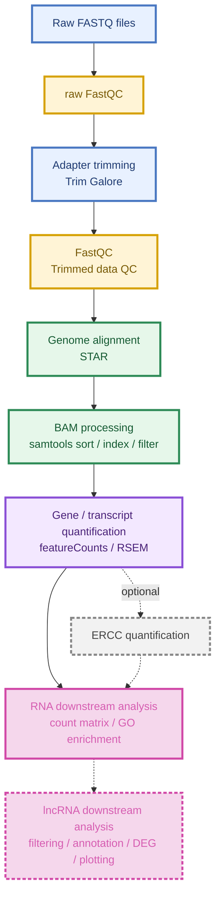

# lncRNA-seq Processing Pipeline

The analysis pipeline for lncRNA sequencing data processes raw FASTQ files through sequential steps such as initial quality control, adapter trimming, read alignment, transcript/gene quantification, expression profiling, and result summarization, and it supports multiple samples. Also, we provide a fully containerized Singularity environment that bundles all required tools and dependencies, and with a single command, the entire workflow can be executed reproducibly on any compatible system.

# Part I Workflow

Here stands an throughout workflow of data analysis.



This workflow is compatible with both single-end and paired-end sequencing data inputs. The execution of ERCC-based quantification, DEG and the lncRNA downstream analysis can be controlled through the configuration file by enabling the corresponding settings and providing the required parameters. Note that if the experimental groups contain no biological replicates, DEG and the lncRNA downstream analysis should be skipped.

# Part II Requirements

1.  **Recommended System Configuration**:

      * 8-core CPU
      * 80 GB RAM

2.  **Singularity**: Must be installed on your system. Below are the detailed steps for installing on an Ubuntu 22.0.4 system. For other operating systems, please refer to the official installation guide: [https://docs.sylabs.io/guides/3.0/user-guide/installation.html](https://docs.sylabs.io/guides/3.0/user-guide/installation.html)

      * **Step 1: Install System Dependencies**

        ```bash
        # Update package lists and install dependencies
        sudo apt-get update
        sudo apt-get install -y \
            build-essential \
            libseccomp-dev \
            libfuse3-dev \
            pkg-config \
            squashfs-tools \
            cryptsetup \
            curl wget git
        ```

      * **Step 2: Install Go Language**

        ```bash
        # Download and install Go
        wget https://go.dev/dl/go1.21.3.linux-amd64.tar.gz
        sudo tar -C /usr/local -xzvf go1.21.3.linux-amd64.tar.gz
        rm go1.21.3.linux-amd64.tar.gz

        # Configure Go environment variables and apply them
        echo 'export GOPATH=${HOME}/go' >> ~/.bashrc
        echo 'export PATH=/usr/local/go/bin:${PATH}:${GOPATH}/bin' >> ~/.bashrc
        source ~/.bashrc
        ```

      * **Step 3: Download, Build, and Install Singularity**

        ```bash
        # Note: The script navigates to /mnt/share/software.
        # You can change this to your preferred directory for source code.
        cd /mnt/share/software

        # Download the Singularity CE source code
        wget https://github.com/sylabs/singularity/releases/download/v4.0.1/singularity-ce-4.0.1.tar.gz

        # Extract the archive and clean up
        tar -xvzf singularity-ce-4.0.1.tar.gz
        rm singularity-ce-4.0.1.tar.gz
        cd singularity-ce-4.0.1

        # Configure the build
        ./mconfig

        # Build Singularity (this can be time-consuming)
        cd builddir
        make

        # Install Singularity to the system
        sudo make install
        ```

      * **Step 4: Verify the Installation**

        ```bash
        # Check the installed version
        singularity --version

        # Display help information
        singularity -h
        ```

3.  **Snakemake**: Snakemake must be installed on your system and requires a Python 3 distribution.

   ```bash
   pip install snakemake
   ```

4.  **Reference Data**: A directory containing the reference genome and gene annotation file is required. Depending on your analysis, additional reference files such as transcriptome FASTA or genome index files may also be needed.

   Example:

   ```bash
   mkdir -p reference
   cd reference

   # Genome FASTA
   wget [<genome_fasta_url>](https://ftp.ebi.ac.uk/pub/databases/gencode/Gencode_mouse/release_M38/GRCm39.primary_assembly.genome.fa.gz)

   # Gene annotation file
   wget [<annotation_gtf_url>](https://ftp.ebi.ac.uk/pub/databases/gencode/Gencode_mouse/release_M38/gencode.vM38.primary_assembly.annotation.gtf.gz)

   # Make rRNA data
   awk '$3=="gene" && (/gene_type "rRNA_pseudogene"/ || /gene_type "rRNA"/) {print $1":"$4"-"$5}' gencode.vM38.primary_assembly.annotation.gtf > rRNA.annotation.txt
   singularity exec ../lncRNAseq.sif samtools faidx GRCm39.primary_assembly.genome.fa -r rRNA.annotation.txt > GRCm39.primary_assembly.rRNA.fa

   ### Build indices
   # Genome index
   singularity exec ../lncRNAseq.sif STAR --runThreadN 8 \
      --runMode genomeGenerate \
      --genomeDir ./star_genome_index \
      --genomeFastaFiles GRCm39.primary_assembly.genome.fa \
      --sjdbGTFfile gencode.vM38.primary_assembly.annotation.gtf \
      --sjdbOverhang 149
   # rRNA index
   mkdir -p bowtie2_rrna_index
   singularity exec ../lncRNAseq.sif bowtie2-build --threads 16 GRCm39.primary_assembly.rRNA.fa bowtie2_rrna_index/rrna
   # RSEM reference
   mkdir -p rsem_index
   singularity exec ../lncRNAseq.sif rsem-prepare-reference --gtf gencode.vM38.primary_assembly.annotation.gtf \
      --num-threads 8 \
      GRCm39.primary_assembly.genome.fa \
      rsem_index/rsem_ref
   # ERCC index (optional)
   singularity exec ../lncRNAseq.sif STAR --runThreadN 8  \
      --runMode genomeGenerate  \
      --genomeDir ./star_ercc_index  \
      --genomeFastaFiles GRCm39.primary_assembly.genome.fa ./ercc/ERCC92.fa \
      --sjdbGTFfile gencode.vM38.primary_assembly.annotation.gtf ./ercc/ERCC92.gtf
   ```

5.  **Data Preparation**: The test data run by this pipeline is from SRR7685878, SRR7685879, SRR7685880 and SRR7685881 in the SRA database. If your data are stored in the SRA database, they can be downloaded and converted to FASTQ format first.

   Example:

   ```bash
   mkdir -p data/samples
   cd data/samples

   prefetch <SRR_ID_1>
   prefetch <SRR_ID_2>

   fastq-dump --gzip --split-files <SRR_ID_1>/<SRR_ID_1>.sra
   fastq-dump --gzip --split-files <SRR_ID_2>/<SRR_ID_2>.sra
   ```

6.  **Required File Structure**

      ```bash
      root/
          ├── config.yaml
          ├── data
          │   ├── reference
          │   │   ├── genome.fa
          │   │   └── annotation.gtf
          │   └── samples
          │       ├── sample1_1.fastq.gz
          │       ├── sample1_2.fastq.gz
          │       ├── sample2_1.fastq.gz
          │       └── sample2_2.fastq.gz
          ├── lncRNA-seq.sif
          ├── scripts
          └── lncRNA-seq.smk
      ```

      - **lncRNA-seq.smk** — The main Snakemake workflow script.  
      - **config.yaml** — Configuration file containing paths, parameters, and sample information.  
        ⚠️ Must be located in the same directory as `lncRNA-seq.smk`.  
      - **lncRNA-seq.sif** — Singularity container image with all required software and dependencies pre-installed.  
      - **scripts/** — Auxiliary scripts used in the pipeline.

# Part III Running

   * **Example code**

      * **Step 1: Edit `config.yaml`**

        ```bash
        # config.yaml
        # Please use ABSOLUTE paths and avoid adding "/" at the end of file folder's path

        # --- 1. Experimental Design ---
        # ERCC spike-in controls (optional)
        # If you have ERCC spike-ins, set to true and provide the path to other necessary files
        # If not using ERCC, set to false and other fields will be ignored
        ercc:
          use_ercc: true
          ercc_fasta: "/mnt1/4.NAS2025/zhangam/easyomics_test/lncRNA-seq/ref/ercc/ERCC92.fa"
          ercc_gtf: "/mnt1/4.NAS2025/zhangam/easyomics_test/lncRNA-seq/ref/ercc/ERCC92.gtf"
          ercc_conc: "/mnt1/4.NAS2025/zhangam/easyomics_test/lncRNA-seq/ref/ercc/ERCC92_conc.txt"
          ercc_star_index: "/mnt1/4.NAS2025/zhangam/easyomics_test/lncRNA-seq/ref/star_ercc_index"
          ercc_analysis_script: "/mnt1/4.NAS2025/zhangam/easyomics_test/lncRNA-seq/scripts/ercc_analysis.R"

        ercc_params:
          # Specify the path to the ERCC spike-in database
          dilution: 100
          ercc_ul: 2
          rna_pg_per_cell: 30
          total_rna_ug: 1

        # Scripts essential for whole pipeline (paths should be ABSOLUTE)
        scripts:
          # R script for differential expression analysis and GO enrichment
          rna_analysis: "/mnt1/4.NAS2025/zhangam/easyomics_test/lncRNA-seq/scripts/rna_seq_analysis.R"
          # R script for lncRNA downstream analysis
          lncRNA_analysis: "/mnt1/4.NAS2025/zhangam/easyomics_test/lncRNA-seq/scripts/lncRNA_analysis.R"
          # If using ERCC, provide the R script for ERCC analysis in Expermental Design section

        # --- 2. Run Parameters ---
        # Path to the Singularity container (lncRNAseq.sif)
        # Use ABSOLUTE path
        container: "/mnt1/4.NAS2025/zhangam/easyomics_test/lncRNA-seq/scripts/lncRNAseq.sif"

        # Output directory for all results
        # Use ABSOLUTE path
        output_dir: "/mnt1/4.NAS2025/zhangam/easyomics_test/lncRNA-seq/Output"

        # --- 3. Samples ---
        # Sample information with paths to FASTQ files
        # For single-end data: omit "R2" field
        # For paired-end data: include both "R1" and "R2" fields
        # Use ABSOLUTE paths for all FASTQ files
        #
        # The "condition" field should match your experimental groups
        # and will be used in differential expression analysis
        samples:
          SRR7685881_control_Rep2:
            R1: "/mnt1/4.NAS2025/zhangam/easyomics_test/lncRNA-seq/data/SRR7685881_control_Rep2.fastq.gz"
            condition: "Control"

          SRR7685880_control_Rep1:
            R1: "/mnt1/4.NAS2025/zhangam/easyomics_test/lncRNA-seq/data/SRR7685880_control_Rep1.fastq.gz"
            condition: "Control"

          SRR7685879_treated_Rep2:
            R1: "/mnt1/4.NAS2025/zhangam/easyomics_test/lncRNA-seq/data/SRR7685879_treated_Rep2.fastq.gz"
            condition: "Treated"

          SRR7685878_treated_Rep1:
            R1: "/mnt1/4.NAS2025/zhangam/easyomics_test/lncRNA-seq/data/SRR7685878_treated_Rep1.fastq.gz"
            condition: "Treated"

        # Remember to keep the file name same with the sample name.
        # Example for single-end data:
        #  Sample_SE:
        #    R1: "/path/to/data/Sample_SE.fastq.gz"
        #    condition: "Control"/...
        #
        # Example for paired-end data:
        #  Sample_PE:
        #    R1: "/path/to/data/Sample_PE_R1.fastq.gz"
        #    R2: "/path/to/data/Sample_PE_R2.fastq.gz"
        #    condition: "Control"/...

        # --- 4. Reference Files ---
        # All paths should be ABSOLUTE paths
        # See README.md for instructions on preparing reference files
        ref:
          # GTF annotation file
          gtf: "/mnt1/4.NAS2025/zhangam/easyomics_test/lncRNA-seq/ref/gencode.vM38.primary_assembly.annotation.gtf"

          # Genome FASTA file
          fasta: "/mnt1/4.NAS2025/zhangam/easyomics_test/lncRNA-seq/ref/GRCm39.primary_assembly.genome.fa"

          # bowtie2 rRNA index
          # Used for removing ribosomal RNA reads
          rrna_bt2_index: "/mnt1/4.NAS2025/zhangam/easyomics_test/lncRNA-seq/ref/bowtie2_rrna_index/rrna"

          # STAR genome index
          star_index: "/mnt1/4.NAS2025/zhangam/easyomics_test/lncRNA-seq/ref/star_genome_index"

          # RSEM reference prefix
          # This should be the directory containing the RSEM reference files
          # The actual reference name should be 'rsem_ref'
          rsem_index: "/mnt1/4.NAS2025/zhangam/easyomics_test/lncRNA-seq/ref/rsem_index"

        # --- 5. Analysis Parameters ---
        # Number of CPU threads to use for parallel processing
        # Recommended: 8 cores
        threads: 8

        params:
          # Adapter sequence for Trim Galore.
          # Set to "" (empty string) to use auto-detection.
          trim_galore_adapter_sequence: ""
          # --- Align Mode Parameters ---
          # featureCounts strand specificity:
          #   0: unstranded
          #   1: stranded (first-strand)
          #   2: reversely stranded (second-strand, most common for Illumina dUTP methods)
          # Default: 2 (reversely stranded)
          featurecounts_strandedness: 2

        # --- 6. Differential Expression Analysis Settings ---
        analysis:
          # Contrast for differential expression analysis
          # Format: [treatment_group, control_group]
          # The first group will be compared against the second (control)
          # These names must match the "condition" values in the samples section
          contrast: ["Treated", "Control"]

          # FDR (False Discovery Rate) threshold for significance
          # Genes with adjusted p-value < fdr_threshold are considered significant
          fdr_threshold: 0.05

          # Log2 fold change threshold for filtering
          # Genes with |log2FoldChange| > lfc_threshold are considered differentially expressed
          lfc_threshold: 1

          # Annotation database for GO enrichment analysis
          # For human: "org.Hs.eg.db"
          # For mouse: "org.Mm.eg.db"
          # For other species, see Bioconductor annotation packages
          r_annotation_db: "org.Mm.eg.db"

          # Organism name for GO enrichment
          # For human: "hsa"
          # For mouse: "mmu"
          organism: "mmu"

          # Whether to perform DESeq2 analysis and the downstream lncRNA-seq analysis
          # If you don't have at least 2 replicated samples for each group, deseq2 should be set to false.
          # If replicated samples are available, you can set to true to perform DESeq2 and GSEA analyses, etc.
          deseq2: true
        ```

      * **Step 2: Dry-run and dag-make**

        Here `/absolute/path/to/root/` represents the root directory.

        ```bash
        # Dry-run
        snakemake -np \
          -s lncRNA-seq.smk \
          --use-singularity \
          --singularity-args "--bind /path/to/root/"

        # Dag-make
        snakemake -s lncRNA-seq.smk \
                  --use-singularity \
                  --singularity-args "--bind /path/to/root/" \
                  --dag | \
        dot -Tsvg > dag.svg
        ```

        Please try dry-run and dag-make first to check pipeline usability and generate a workflow diagram.

      * **Step 3: Run snakemake**

        Here `/path/to/root/` represents the root directory.

        ```bash
        snakemake -s lncRNA-seq.smk \
          --cores 8 \
          --use-singularity \
          --singularity-args "--bind /path/to/root/"
        ```

   * **Command Parameters**

      **edit `config.yaml`**
      - `use_ercc`:(required) Whether to enable ERCC spike-in analysis.
      - `ercc_fasta`:(required if `use_ercc: true`) FASTA file containing ERCC spike-in sequences.
      - `ercc_gtf`:(required if `use_ercc: true`) GTF annotation file for ERCC spike-ins.
      - `ercc_conc`:(required if `use_ercc: true`) ERCC concentration reference table used for absolute quantification.
      - `ercc_star_index`:(required if `use_ercc: true`) STAR index built from ERCC reference sequences, used to estimate ERCC read counts.
      - `ercc_analysis_script`:(required if `use_ercc: true`) Path to `ercc_analysis.R`, which performs absolute RNA quantification based on ERCC spike-ins.
      - `dilution`:(required if `use_ercc: true`) Dilution factor of the ERCC mix used in library preparation.
      - `ercc_ul`:(required if `use_ercc: true`) Volume of diluted ERCC mix added to each sample, in µL.
      - `rna_pg_per_cell`:(required if `use_ercc: true`) Estimated total RNA mass per cell for the biological system, in picograms.
      - `total_rna_ug`:(required if `use_ercc: true`) Amount of total RNA used for library preparation, in micrograms.

      - `samples`:(required) A dictionary of all input samples.
        - Each sample must include:
          - `R1`: path to the FASTQ file
          - `R2`: optional, if paired-end sequencing was used
          - `condition`: experimental group label used for differential expression analysis
      - `container`:(required) Singularity image containing all software and dependencies.
      - `output_dir`:(required) Root directory where all pipeline outputs will be written.
      - `threads`:(optional) Number of CPU threads used by parallel rules. Default: 8.
      - `ref.gtf`:(required) Gene annotation file used for featureCounts and lncRNA annotation.
      - `ref.fasta`:(required) Reference genome FASTA file.
      - `ref.rrna_star_index`:(required) STAR index used to remove rRNA-mapped reads.
      - `ref.star_index`:(required) STAR genome index used for read alignment.
      - `ref.rsem_index`:(required) RSEM reference prefix used for transcript abundance estimation.
      - `params.trim_galore_adapter_sequence`:(optional) Adapter sequence passed to Trim Galore. Leave empty to auto-detect.
      - `params.featurecounts_strandedness`:(required) Strand specificity for featureCounts. 0 = unstranded, 1 = stranded, 2 = reversely stranded.
      - `analysis.contrast`:(required) Differential expression contrast in the form `[treatment, control]`.
      - `analysis.fdr_threshold`:(required) Adjusted p-value cutoff used in DESeq2 and lncRNA downstream filtering.
      - `analysis.lfc_threshold`:(required) Absolute log2 fold-change cutoff used for significance filtering.
      - `analysis.r_annotation_db`:(required) Annotation database used for ID conversion and GO enrichment, e.g. `org.Mm.eg.db` or `org.Hs.eg.db`.
      - `analysis.organism`:(required) Organism code used for enrichment analysis, e.g. `mmu` or `hsa`.
      - `analysis.deseq2`:(required) Whether to run DESeq2 and lncRNA downstream analysis.

      **run snakemake**
      - `--use-singularity`: Enables execution of rules within a Singularity container to ensure a fully reproducible environment.
      - `--singularity-args`: Allows passing additional arguments to the Singularity runtime, such as `--bind`.
      - `--cores`: Specifies the maximum number of CPU cores that Snakemake can use in parallel when executing workflow rules.
      - `--bind`: Specifies the directories to be mounted within the Singularity container. Include all required paths such as raw data, scripts, container images, and references.

# Part IV Output

   * **Output Structure**
      ```bash
      output_dir/
          ├── qc
          │   ├── raw
          │   └── trimmed
          ├── intermediate
          ├── results
          │   ├── featureCounts.gene_counts.symbol.tsv
          │   ├── RSEM.gene_tpm.symbol.tsv
          │   ├── <treat>_vs_<control>.deseq2_results.csv
          │   ├── <treat>_vs_<control>.volcano_plot.png
          │   ├── <treat>_vs_<control>.GO_enrichment.csv
          │   ├── <treat>_vs_<control>.GO_dotplot.png
          │   ├── <sample>_ERCC_standard_curve.pdf
          │   ├── <sample>_mpc.txt
          │   ├── multiqc_data
          │   └── multiqc_report.html
          ├── logs
          └── lncRNA_analysis_output
              ├── plots
              ├── tables
              └── gsea
      ```

   * **Output Interpretation**

      - **`results/multiqc_report.html`**
        
        - **Content**: A combined quality-control report summarizing FastQC, trimming, alignment, and other workflow-level metrics across all samples.
        - **Application**: Used as the first file to inspect overall data quality and pipeline performance for all samples.

      - **`results/featureCounts.gene_counts.symbol.tsv`**
        
        - **Content**: Gene symbol–level read count matrix after ENSEMBL ID conversion and aggregation.
        - **Application**: Used for downstream RNA-seq analysis and easier interpretation at the gene symbol level.

      - **`results/RSEM.gene_tpm.symbol.tsv`**
        
        - **Content**: Gene symbol–level TPM matrix aggregated from RSEM results.
        - **Application**: Used to summarize transcript abundance and support expression-level comparisons across samples.

      - **`results/<treat>_vs_<control>.deseq2_results.csv`**
        
        - **Content**: DESeq2 differential expression result table, including `baseMean`, `log2FoldChange`, `lfcSE`, `stat`, `pvalue`, `padj`, and gene annotations such as symbol and Entrez ID.
        - **Application**: Used to identify differentially expressed genes between the treatment and control groups and to support downstream visualization and enrichment analysis.

      - **`results/<treat>_vs_<control>.volcano_plot.png`**
        
        - **Content**: Volcano plot of differential expression results, showing significantly upregulated and downregulated genes.
        - **Application**: Used for a quick visual summary of DESeq2 results and identification of the most notable DE genes.

      - **`results/<treat>_vs_<control>.GO_enrichment.csv`**
        
        - **Content**: GO enrichment result table for significantly differentially expressed genes.
        - **Application**: Used to identify overrepresented biological processes, molecular functions, or cellular components among DE genes.

      - **`results/<treat>_vs_<control>.GO_dotplot.png`**
        
        - **Content**: GO enrichment dotplot generated from the enriched GO terms.
        - **Application**: Used to visualize the most significant GO categories and their enrichment strength.

      - **`results/<sample>_ERCC_standard_curve.pdf`**
        
        - **Content**: ERCC standard curve showing the relationship between ERCC molecule input and observed RPKM values.
        - **Application**: Used to evaluate ERCC-based absolute quantification performance and the linearity of spike-in measurements.
        
            

      - **`results/<sample>_mpc.txt`**
        
        - **Content**: Absolute RNA quantification table reporting estimated molecules per cell for each gene.
        - **Application**: Used to estimate transcript abundance in biological units and compare lncRNA / mRNA abundance at the cellular level.

      - **`lncRNA_analysis_output/`**
    
        - The output for end-to-end downstream analysis pipeline for RNA-seq differential expression data, with a focus on identifying and characterising long non-coding RNAs (lncRNAs).
        - Check https://github.com/Cingoz-Lab/lncRNA-Analysis (ref 2) for details.
          
# Part V Reference

[1] Schertzer, M. D., Murvin, M. M. and Calabrese, J. M. (2020). Using RNA Sequencing and Spike-in RNAs to Measure Intracellular Abundance of lncRNAs and mRNAs. Bio-protocol 10(19): e3772.

[2] Bora, F. E. (2026). lncRNA Analysis Pipeline (Version 1.0.0) [Computer software]. https://github.com/Cingoz-Lab/lncRNA-Analysis
